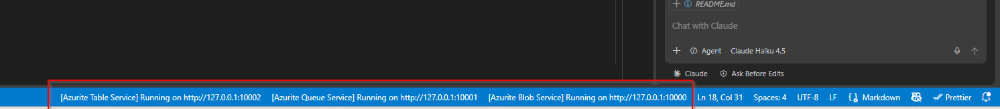
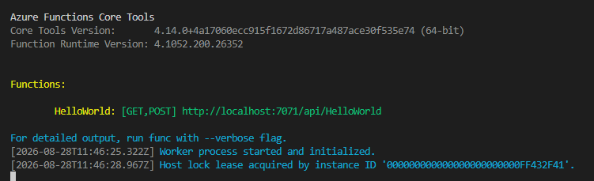

# devcontainer workshop

## Requirements

- docker desktop
- vscode with dev containers extenstion installed: ms-vscode-remote.remote-containers
- git installed locally

## how to install

- clone this repo in a local map on the computer
- open the folder in vscode
- vscode will ask to start the devcontainer
- first start will pull the image (5gb) and customize it

## how to use

- start the 3 azurite services
- 
- press f5
- debugger wil start and the function host will start
- 
- click on the url
